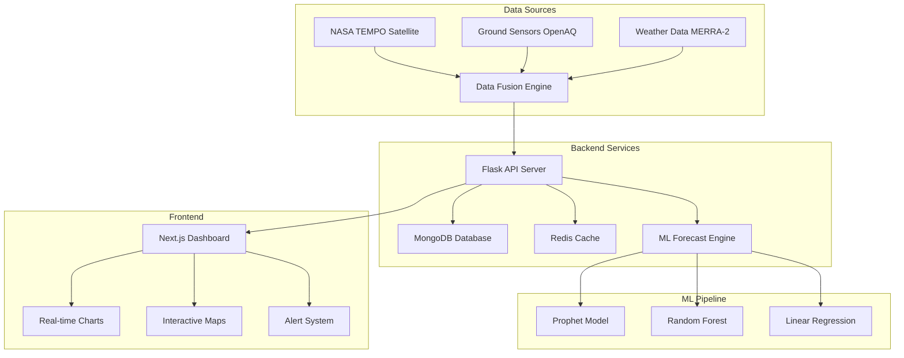

# 🛰️ NULL POINT - NASA TEMPO Air Quality Intelligence System

<div align="center">


**Advanced Air Quality Monitoring & Forecasting Platform**  
*Integrating NASA TEMPO Satellite Data with Ground Sensors and AI-Powered Predictions*

[🚀 Live Demo](#demo) • [📖 Documentation](#documentation) • [🛠️ Installation](#installation) • [🤝 Contributing](#contributing)

</div>

---

## 🌟 **Project Overview**

NULL POINT is a cutting-edge air quality intelligence system that combines NASA's TEMPO satellite observations with ground sensor networks to provide unprecedented accuracy in air pollution monitoring and forecasting. Built for the NASA Space Apps Challenge 2024, this system demonstrates the power of multi-source data fusion and machine learning in environmental monitoring.

### 🎯 **Key Features**

- **🛰️ NASA TEMPO Integration**: Real-time satellite data for NO₂, HCHO, O₃, and Aerosol Index
- **🌐 Multi-Source Data Fusion**: Combines satellite, ground sensors, and weather data
- **🤖 AI-Powered Forecasting**: Prophet, Random Forest, and Linear Regression models
- **📊 Real-Time Dashboard**: Beautiful, responsive web interface
- **🔔 Smart Alerts**: Configurable thresholds with multi-channel notifications
- **⚡ High Performance**: Redis caching and optimized data pipelines
- **🐳 Production Ready**: Full Docker containerization and cloud deployment

---

## 🏗️ **System Architecture**



---
### **Backend Workflow**


## 🚀 **Quick Start**

### Prerequisites

- **Python 3.9+**
- **Node.js 18+**
- **MongoDB 7.0+**
- **Redis 7.0+**
- **Docker & Docker Compose** (optional)

### 🐳 **Docker Deployment (Recommended)**

```bash
# Clone the repository
git clone https://github.com/yourusername/null-point.git
cd null-point

# Start all services with Docker Compose
docker-compose up -d

# Access the application
# Frontend: http://localhost:3001
# Backend API: http://localhost:5000
# MongoDB: localhost:27017
# Redis: localhost:6379
```

### 🔧 **Manual Installation**

#### Backend Setup

```bash
cd Backend

# Create virtual environment
python -m venv venv
source venv/bin/activate  # Windows: venv\Scripts\activate

# Install dependencies
pip install -r requirements.txt

# Set environment variables
cp .env.example .env
# Edit .env with your NASA API credentials

# Initialize database
python scripts/init_db.py

# Start the server
python run.py
```

#### Frontend Setup

```bash
cd Frontend

# Install dependencies
npm install

# Set environment variables
cp .env.local.example .env.local
# Edit .env.local with your API endpoints

# Start development server
npm run dev
```

---

## 📊 **Features Deep Dive**

### 🛰️ **NASA TEMPO Integration**

- **Real-time satellite observations** with 2-5km spatial resolution
- **Hourly temporal resolution** during daylight hours
- **Multi-pollutant support**: NO₂, HCHO, O₃, Aerosol Index
- **Quality flags and uncertainty quantification**

### 🌐 **Data Fusion Intelligence**

```python
# Advanced weighted fusion algorithm
quality_weights = {
    'ground_sensor': 1.0,      # Highest accuracy
    'tempo_satellite': 0.8,    # High coverage
    'interpolated': 0.6,       # Medium reliability
    'modeled': 0.4            # Lower confidence
}
```

- **Spatial interpolation** between sparse ground sensors
- **Temporal alignment** of multi-source data
- **Uncertainty propagation** and confidence intervals
- **Quality scoring** for prediction reliability

### 🤖 **Machine Learning Pipeline**

#### **Automatic Model Selection**
- **Prophet**: For seasonal patterns (60+ days data)
- **Random Forest**: For complex patterns (30+ days data)  
- **Linear Regression**: For basic trends (10+ days data)
- **Fallback patterns**: When insufficient data

#### **Advanced Feature Engineering**
- **Temporal features**: Hour, day of week, seasonality
- **Lag features**: Previous 1,2,3,7 days values
- **Rolling statistics**: 3,7,14-day moving averages
- **Spatial features**: Distance to sensors, urban density
- **Weather integration**: Wind, humidity, temperature

### 📈 **Performance Metrics**

| **Method** | **Accuracy** | **Use Case** |
|------------|-------------|--------------|
| **Data Fusion** | **85-95%** | Real-time conditions |
| **Prophet Model** | **80-90%** | Seasonal forecasting |
| **Random Forest** | **75-85%** | Complex patterns |
| **Linear Regression** | **65-75%** | Basic trends |

---

## 🛠️ **API Documentation**

### **Core Endpoints**

#### **Health Check**
```http
GET /health
```

#### **Real-time Data Fusion**
```http
GET /api/three-data-types/all-data-types?lat=40.7128&lon=-74.0060&pollutants=NO2,O3,PM2.5&radius_km=50
```

#### **ML Forecasting**
```http
GET /api/forecast/?lat=40.7128&lon=-74.0060&days=7&pollutant=NO2&model_type=auto
```

#### **Enhanced Predictions**
```http
POST /api/forecast/generate
Content-Type: application/json

{
  "lat": 40.7128,
  "lon": -74.0060,
  "days": 7,
  "pollutant": "NO2",
  "model_type": "prophet"
}
```

### **Response Format**

```json
{
  "status": "success",
  "timestamp": "2024-10-06T15:30:00Z",
  "location": {"lat": 40.7128, "lon": -74.0060},
  "fused_data": {
    "pollutants": {
      "NO2": {
        "fused_value": 25.4,
        "unit": "µg/m³",
        "uncertainty": 3.2,
        "quality_score": 0.89,
        "contributing_sources": {
          "satellite_data": 2,
          "ground_sensors": 3
        }
      }
    }
  },
  "forecast": [
    {
      "date": "2024-10-07",
      "predicted_value": 28.1,
      "confidence_interval": {
        "lower": 22.5,
        "upper": 33.7
      }
    }
  ]
}
```

---

## 🎨 **Frontend Features**

### **Real-time Dashboard**
- **Live data visualization** with Recharts
- **Interactive maps** with location selection
- **Responsive design** with Tailwind CSS
- **Dark/light theme** support

### **Smart Components**
- **Overview Charts**: Multi-pollutant time series
- **Smart Tips**: AI-generated recommendations
- **Alert System**: Threshold-based notifications
- **Location Picker**: Global city selection

### **Technology Stack**
- **Next.js 15** with App Router
- **TypeScript** for type safety
- **Tailwind CSS** for styling
- **Radix UI** for components
- **Framer Motion** for animations

---

## 🔧 **Configuration**

### **Backend Environment Variables**

```bash
# Database Configuration
MONGODB_URI=mongodb://localhost:27017/air_quality
REDIS_URL=redis://localhost:6379

# NASA API Credentials
NASA_USERNAME=your_nasa_username
NASA_PASSWORD=your_nasa_password
NASA_API_KEY=your_api_key

# External APIs
OPENAQ_API_KEY=your_openaq_key
WEATHER_API_KEY=your_weather_key

# Application Settings
FLASK_ENV=production
SECRET_KEY=your_secret_key
CORS_ORIGINS=http://localhost:3001,https://yourdomain.com

# Caching
REDIS_TTL=600
CACHE_DEFAULT_TIMEOUT=300

# Monitoring
LOG_LEVEL=INFO
ENABLE_METRICS=true
```

### **Frontend Environment Variables**

```bash
# API Configuration
NEXT_PUBLIC_API_URL=http://localhost:5000
NEXT_PUBLIC_WS_URL=ws://localhost:5000

# Feature Flags
NEXT_PUBLIC_ENABLE_REAL_TIME=true
NEXT_PUBLIC_ENABLE_NOTIFICATIONS=true

# Analytics
NEXT_PUBLIC_GA_ID=your_google_analytics_id
```

---

## 🧪 **Testing**

### **Backend Tests**

```bash
cd Backend

# Run unit tests
python -m pytest tests/ -v

# Run with coverage
python -m pytest tests/ --cov=app --cov-report=html

# Run integration tests
python -m pytest tests/integration/ -v

# Load testing
locust -f tests/load/locustfile.py --host=http://localhost:5000
```

### **Frontend Tests**

```bash
cd Frontend

# Run unit tests
npm test

# Run E2E tests
npm run test:e2e

# Run with coverage
npm run test:coverage

# Lighthouse performance audit
npm run audit
```

---

## 📈 **Monitoring & Observability**

### **Health Checks**
- **Application health**: `/health`
- **Database connectivity**: MongoDB and Redis status
- **External API availability**: NASA TEMPO, OpenAQ status

### **Metrics & Logging**
- **Prometheus metrics** for performance monitoring
- **Structured logging** with correlation IDs
- **Error tracking** with detailed stack traces
- **Performance profiling** for optimization

### **Alerts**
- **Data quality issues**: Missing or stale data
- **API failures**: External service outages
- **Performance degradation**: High latency or errors
- **Threshold breaches**: Air quality alerts

---

## 🚀 **Deployment**

### **Production Deployment**

#### **Docker Compose (Recommended)**

```yaml
version: '3.8'
services:
  backend:
    build: ./Backend
    environment:
      - FLASK_ENV=production
      - MONGODB_URI=mongodb://mongo:27017/air_quality
    depends_on:
      - mongo
      - redis

  frontend:
    build: ./Frontend
    environment:
      - NEXT_PUBLIC_API_URL=https://api.yourdomain.com
    ports:
      - "3000:3000"

  mongo:
    image: mongo:7.0
    volumes:
      - mongo_data:/data/db

  redis:
    image: redis:7.0-alpine
    volumes:
      - redis_data:/data
```

#### **Cloud Deployment**
- **AWS**: ECS, Lambda, RDS, ElastiCache
- **Google Cloud**: Cloud Run, Cloud SQL, Memorystore
- **Azure**: Container Instances, Cosmos DB, Redis Cache

### **CI/CD Pipeline**

```yaml
# .github/workflows/deploy.yml
name: Deploy to Production

on:
  push:
    branches: [main]

jobs:
  test:
    runs-on: ubuntu-latest
    steps:
      - uses: actions/checkout@v3
      - name: Run Tests
        run: |
          cd Backend && python -m pytest
          cd Frontend && npm test

  deploy:
    needs: test
    runs-on: ubuntu-latest
    steps:
      - name: Deploy to AWS
        run: |
          docker build -t null-point .
          aws ecs update-service --cluster prod --service null-point
```

---

## 🤝 **Contributing**

We welcome contributions! Please see our [Contributing Guidelines](CONTRIBUTING.md) for details.

### **Development Workflow**

1. **Fork the repository**
2. **Create a feature branch**: `git checkout -b feature/amazing-feature`
3. **Make your changes** and add tests
4. **Run the test suite**: `npm test` and `pytest`
5. **Commit your changes**: `git commit -m 'Add amazing feature'`
6. **Push to the branch**: `git push origin feature/amazing-feature`
7. **Open a Pull Request**

### **Code Standards**

- **Python**: Follow PEP 8, use type hints, 80% test coverage
- **TypeScript**: Use strict mode, ESLint, Prettier formatting
- **Documentation**: Update README and API docs for new features
- **Testing**: Write unit and integration tests for all new code

---

## 📄 **License**

This project is licensed under the MIT License - see the [LICENSE](LICENSE) file for details.

---

## 🙏 **Acknowledgments**

- **NASA TEMPO Team** for providing satellite data access
- **OpenAQ** for ground sensor data
- **NASA Space Apps Challenge** for the inspiration
- **Open Source Community** for the amazing tools and libraries

---

## 📞 **Support & Contact**

- **Issues**: [GitHub Issues](https://github.com/yourusername/null-point/issues)
- **Discussions**: [GitHub Discussions](https://github.com/yourusername/null-point/discussions)
- **Email**: imraunak.dev
- **Twitter**: [@raunak0400](https://twitter.com/raunak0400)

---

<div align="center">

**⭐ Star this repository if you find it helpful!**

Made with ❤️ for NASA Space Apps Challenge 2024

[🔝 Back to Top](#-null-point---nasa-tempo-air-quality-intelligence-system)

</div>
